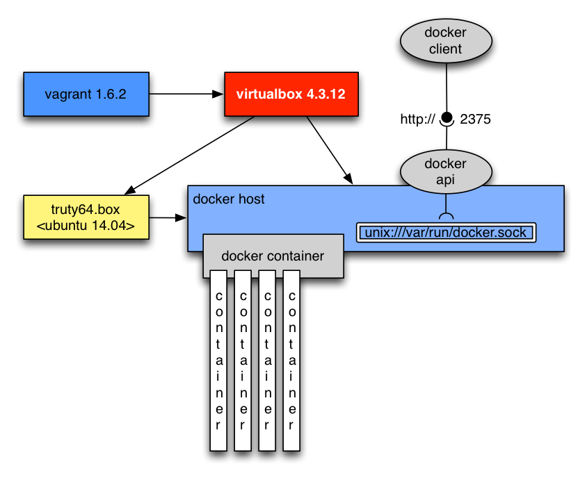

# Einfache Installation eine Docker Entwicklungsumgebung

Für Beispiele im Bereich der Netzwerke ist es ratsam lieber ein 
eigene Linux Distribution mit Virtualbox und Vagrant aufzusetzen.

Wir verwenden dafür ein aktuelles Trusty Ubuntu 14.04 LTS.

Die Docker Provisionierung haben wir in drei Teile aufgeteilt:

  - provision.d/01_packages.shprov
    - Aktuallisierung aller Packages
    - Bereitstellen von zusätzlichen Packages
  - provision.d/10_docker.shprov
    - Installation von Docker
  - provision.d/15_docker_prepare_image.shprov
    - laden des ubunutu base images
    - Test eines einfachen Testcontainers.

## Mehr ist möglich

  - [Unser infrabricks Blog](http://www.infrabricks.de)
  - [Vagrant Provisioierung mit Docker](http://docs.vagrantup.com/v2/provisioning/docker.html)
  - [Postgres, redis und elasticsearch mit Docker starten](http://maori.geek.nz/post/vagrant_with_docker_how_to_set_up_postgres_elasticsearch_and_redis_on_mac_os_x)
    - hilfreiche Tipps zur einfach Installation der Umgebung auf einem Mac
    - Nutzung eines Vagrant File Plugin um damit die verschienden Container mit Vagrant zu administieren.
  - [Starten von 100 Docker Containern auf einem Host](https://blog.codecentric.de/2014/01/leichtgewichtige-virtuelle-maschinen-mit-docker-oder-wie-man-100-vms-laufen/)
  - [Java Entwicklungsumgebung mit Vagrant und Puppet](http://jaxenter.de/artikel/Vagrant-Puppet-fuer-Java-Entwickler-Einweg-VMs-zur-Runtime-erstellen)

Gruss
Peter Rossbach <peter.rossbach@bee42.com>