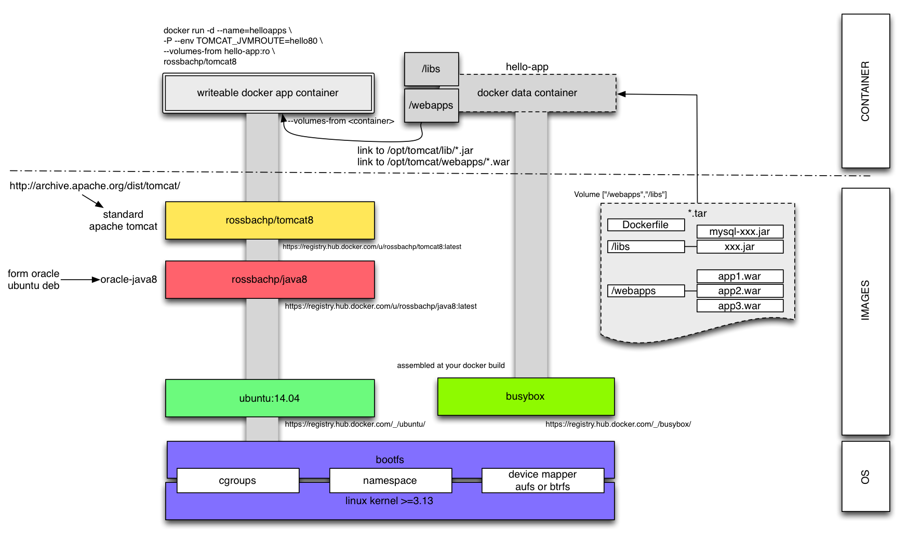

# Tomcat 8 Dockerfile

This repository contains **Dockerfile** of [µ](https://tomcat.apache.org/) for [Docker](https://www.docker.io/)'s [personal build](https://index.docker.io/u/rossbachp/tomcat8/) published to the public [Docker Registry](https://index.docker.io/).

## Design

## Dependencies

* [ubuntu](http://index.docker.io/u/_ubuntu)
* [Dockerbox: rossbachp/java8](http://github.com/rossbachp/dockerbox)
* [Apache Tomcat 8 Download ](https://archive.apache.org/dist/tomcat/tomcat-8)

## Installation

1. Install [Docker](https://www.docker.io/).
2. Download [my java 8 build](https://index.docker.io/u/rossbachp/java8/) or from public [Docker Registry](https://index.docker.io/): `docker pull rossbachp/java8`
3. Download [my tomcat 8 build](https://index.docker.io/u/rossbachp/tomcat8/) or from public [Docker Registry](https://index.docker.io/): `docker pull rossbachp/tomcat8`

## Usage

    docker run -it --rm rossbachp/tomcat8

### Run _tomcat with a sample hello world_

    mkdir -p hello
    cd hello
    echo "Hello Docker Tomcat World" >index.jsp
    jar -cf ../hello.war .
    cd ..
    docker run --name=tomcat8 -d -p 8080:8080 -v `pwd`:/webapps rossbachp/tomcat8
    curl http://127.0.0.1:8080/hello/index.html

### get _tomcat container IP and ports_

    $ DOCKER_HOST_IP=$(docker inspect -f '{{.NetworkSettings.IPAddress}}'
    $ docker inspect -f '{{ range $key, $value := .NetworkSettings.Ports }}{{ $key }}='"${DOCKER_HOST_IP}:"'{{ (index $value 0).HostPort }} {{ end }}‘ tomcat8 | tr " " "\n"
    8080/tcp=172.17.0.30:8080
    8009/tcp=172.17.0.30:8009

### deploy your own war's/webapps

deploy some application war file at your local webapps directory
    docker run -it --rm -v `pwd`/webapps:/webapps rossbachp/tomcat8

deploy with some tomcat extensions

    docker run -it --rm -v `pwd`/webapps:/webapps -v `pwd`/libs:/libs rossbachp/tomcat8

deploy with your system parameters

    docker run -it --rm -e CATALINA_OPTS="-Ddb.user=admin -Ddb.password=secret" -v `pwd`/webapps:/webapps -v `pwd`/libs:/libs rossbachp/tomcat8

your your own JVM_ROUTE

    docker run -it --rm -e TOMCAT_JVM_ROUTE=tomcat79 -p 7980:8080 -p 7909:8009 -v `pwd`/webapps:/webapps rossbachp/tomcat8

### Run `list all deployed apps`

    $ DOCKER_HOST_IP=$(docker inspect -f '{{.NetworkSettings.IPAddress}}' tomcat8)
    $ curl --user "admin:password" http://${DOCKER_HOST_IP}:8080/manager/text/list
    OK - Listed applications for virtual host localhost
    /manager:running:0:manager

Password can be extract from logs:

    $ docker logs tomcat8 | head
    => Creating and admin user with a random password in Tomcat
    => Done!
    ========================================================================
    You can now configure to this Tomcat server using:

        admin:H4t4bbyZxjNh

    ========================================================================
    Checking *.war in /webapps
    Checking tomcat extended libs *.jar in /libs

or set at your tomcat docker container start:

    docker run -d --name=tomcat8 --env TOMCAT_PASS=password rossbachp/tomcat8

### monitor tomcat with nsenter

Install [nsenter](https://github.com/jpetazzo/nsenter):

    sudo docker run --rm -v /usr/local/bin:/target jpetazzo/nsenter

Tail tomcat logs

    sudo docker-enter tomcat8 tail -f /opt/tomcat/logs/catalina-2014-08-27.log

or

    sudo docker logs tail tomcat8

Run jstat

    sudo docker-enter tomcat8 su tomcat --shell /bin/bash -c 'jstat -gc 1 5000'

run jonsole?

load jolokia and monitor via http

## build, squash and push

    sudo bash
    cd /tmp
    docker build -t="rossbachp/tomcat8" .
    ID=$(docker inspect -f '{{ .Id }}' rossbachp/tomcat8)
    docker save $ID > tomcat8.tar
    sudo docker-squash -verbose -i tomcat8.tar -o tomcat8-squash.tar -t rossbachp/tomcat8:squash
    cat tomcat8-squash.tar | docker load
    rm tomcat8.tar
    rm tomcat8-squash.tar

or simple use the ``./build.sh` or with cleanup `./build.sh --rmi`

### Push to registry

    docker login
    docker push rossbachp/tomcat8:latest
    docker push rossbachp/tomcat8:<DATE TAG>

### Links

* [squashing-docker article](http://jasonwilder.com/blog/2014/08/19/squashing-docker-images/)
* [github squashing-docker](https://github.com/jwilder/docker-squash)

## Other tomcat docker images

* [ ConSol docker-appserver](https://github.com/ConSol/docker-appserver)
* [tutum docker  tomcat images](https://github.com/tutumcloud/tutum-docker-tomcat)
